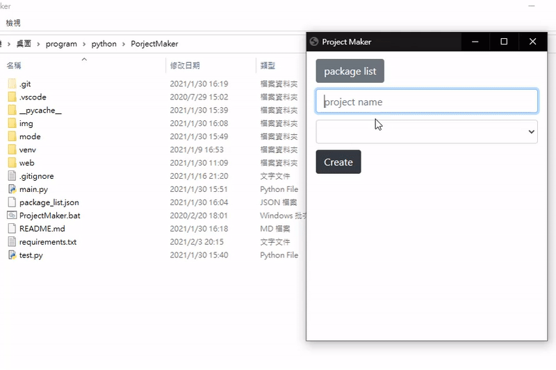

## ProJect Maker
簡化建立Python流程，可以自行選擇創建虛擬環境，以及安裝套件，透過複製檔案的方式建立專案，因此應該也是可以建立其他語言專案的，但這部分我還沒有測試過。

輸入專案名稱，會顯示選項（可自行新增），勾選後即可建立專案。

點擊package list按鈕後進入編輯packag畫面，可新增、刪除、修改名稱、指令、目標專案。

`name`：建立專案時顯示的文字，`create venv`和`freeze requirements`建議不要做修正（為了安裝套件，必須執行虛擬環境，因此要先建立虛擬環境，安裝完套件後再紀錄專案套件），若修改了，應該會出錯，因為我在建立專案時用的判斷方法很粗糙。

`command`：輸入command指令，若超過兩行時請以`,`做間隔。

`targets`：針對指定專案進行顯示，例如`Python`代表所有Python專案都可選擇，`eel`則代表僅有eel專案才可選擇，若超過兩個時請以`,`做間隔。

